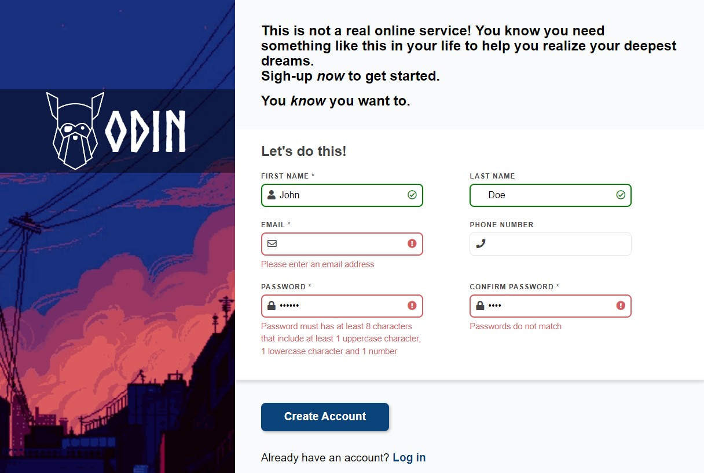

# The Odin Project - Intermediate HTML and CSS Course

## Project: Sign-Up Form

## [Live](https://isikava.github.io/sign-up-form/)



Sign-up form for an imaginary service.

## Functionality

- Using native HTML5 and JavaScript validation.
- First name, Email, Passwords are required, Last name and Phone are optional.
- Displays error messages for form validation within the elements of the page.
- Instant feedback on input with error, success icons.

## Usage

Use native HTML5 attributes like `required`, `minlength` etc. for basic validation, if JavaScript is disabled on the client.  
To make these attributes work with JS, add them to the options object, add rules and error messages for them.

```javascript
const options = [
  {
    attribute: '', // html5 attribute, string
    invalid: (input) => {}, // rule, return boolean
    errorMessage: (input) => '', // error message, return string
},
```

Each field will validate against these options.

To add additional custom rules for a field, add them to the validations object by field id.

```javascript
const validations = {
  'field id': {
    isValid: (input) => input.checkValidity(), // rule, return boolean
    errorMessage: '', // error message, string
  },
};
```
